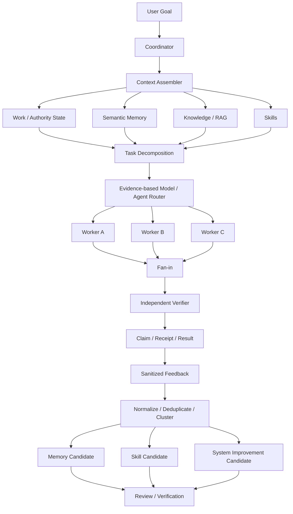

# AKTIF_GOREV.md

## Yönetici özeti

Bu görev Zekam'a bağımsız bir "Second Brain", ikinci bir skill engine veya ikinci bir orchestration framework ekleme görevi değildir.

Amaç, repository'de var olan memory/knowledge, continuity/resume, Work Graph, personal skill lifecycle, evolution/learning, model routing, agent roles, policy, claim ve receipt mekanizmalarını tek bir uçtan uca bilişsel çalışma hattına bağlamaktır:

```text
Context
  -> Decomposition
  -> Agent/Model Routing
  -> Worker Execution
  -> Fan-in
  -> Independent Verification
  -> Receipt/Result
  -> Sanitized Feedback
  -> Memory/Skill/System Improvement Candidate
```

Görev boyunca temel invariant şudur:

```text
memory != authority
skill != authority
context != authority
feedback != authority
model recommendation != authority
```

Uygulayıcı agent bu dosyayı gördüğünde ek görev istemeden çalışmaya başlamalıdır.

Discovery tek başına teslim değildir.

## Baseline ve revision politikası

Bu görevin kanonik baseline revision'ı:

```text
repository = mehmet-karacan/zekam
commit     = 4629e9e58f8a74bbaad1e76e362893628837c823
```

Araştırma sırasında `main` dalının bu committen daha ileri bir revision'a geçmiş olduğu gözlenmiştir.

Bu nedenle:

```text
HEAD == baseline
    -> doğrudan uygula

HEAD != baseline ve baseline ancestor/current branch ilişkisi var
    -> farkı ölç
    -> bu görevin semantic hedeflerini koru
    -> yeni code layout'a kontrollü port et
    -> finalde baseline mismatch'i raporla

HEAD ilgisiz/diverged
    -> sessizce başka revision'a uygulama
    -> exact baseline worktree/branch kullan
```

Baseline SHA hiçbir durumda sessizce değiştirilmez.

Push yetkisi yoktur.

## Başlangıç protokolü

İlk işlem sırası:

```bash
git status --short
git rev-parse HEAD
git cat-file -e 4629e9e58f8a74bbaad1e76e362893628837c823^{commit}
git show -s --format='%H%n%P%n%s%n%ci' \
  4629e9e58f8a74bbaad1e76e362893628837c823
```

Sonra repository içindeki bootstrap authority dosyalarını mevcutsa oku:

```text
AGENTS.md
00_BASLA.md
DEVAM_PROTOKOLU.md
GLOBAL_DEFINITION_OF_DONE.md
PROJE_MANIFESTI.yaml
AKTIF_GOREV.md
```

Repository'deki canonical kurallar bu görevle çelişmiyorsa korunur.

Ardından:

```bash
python scripts/paket_dogrula.py
```

çalıştır.

Başlangıç validator'ı başarısızsa:

- hatayı kaydet;
- failure'ın bu görevin değişikliğinden önce mevcut olduğunu işaretle;
- güvenli olduğu ölçüde göreve devam et;
- final raporunda before/after ayrımını açıkça göster.

## Deterministic repository discovery

Kod yazmadan önce tek seferlik bounded discovery yap.

Exact baseline tree:

```bash
BASELINE=4629e9e58f8a74bbaad1e76e362893628837c823

git ls-tree -r --name-only "$BASELINE" > /tmp/zekam-files.txt

grep -E \
'workspace_resume|memory|knowledge|continuity|skill|model_routing|evolution|learning|doctor|capability|work' \
/tmp/zekam-files.txt
```

Exact sembol discovery:

```bash
git grep -nE \
'SemanticMemory|MemoryCandidate|WorkspaceResume|Resume|SkillRuntime|PersonalSkill|SkillPackage|ModelRout|EvolutionCapture|Learning|WorkGraph|Doctor|CapabilityInventory' \
"$BASELINE" -- 'src/**/*.py' 'tests/**/*.py' || true
```

Aşağıdaki baseline path'leri özellikle doğrula:

```text
src/zekam/application/workspace_resume.py
src/zekam/application/evolution_capture.py
src/zekam/application/learning_daily_compiler.py
src/zekam/application/evolution_runtime.py
src/zekam/application/skill_packages.py
src/zekam/application/skill_runtime.py

src/zekam/domain/personal_skill.py
src/zekam/domain/skill_package.py
src/zekam/domain/model_routing.py

src/zekam/infrastructure/sqlite/local_learning.py
src/zekam/infrastructure/sqlite/skill_lifecycle.py

src/zekam/interfaces/cli/skill.py
src/zekam/interfaces/cli/model.py

src/zekam/application/capability_inventory.py

.opencode/agents/
src/zekam/skills/
```

Bir path yoksa:

```text
path missing
    != "özellik yok"
```

Önce semantic equivalent ara.

Equivalent varsa mevcut implementation'ı EXTEND/CONNECT et.

Equivalent yoksa bu görevde belirtilen minimal yeni modülü oluştur.

Aynı capability için paralel framework oluşturma.

## Fit-gap sınıflandırması

Discovery sonucu her alanı aşağıdakilerden biriyle sınıflandır:

```text
REUSE
EXTEND
CONNECT
REPLACE
REMOVE
```

Kurallar:

```text
REUSE
mevcut davranış hedefi zaten karşılıyor

EXTEND
mevcut doğru bounded context içinde eksik davranış var

CONNECT
iki mevcut capability var fakat birbirine bağlı değil

REPLACE
mevcut implementation hedef invariant ile yapısal olarak çelişiyor

REMOVE
duplicate/dead/unsafe implementation mevcut
```

`REPLACE` ve `REMOVE` için code evidence zorunludur.

"Yeni mimari daha temiz olur" gerekçesi yeterli değildir.

## Mimari invariantlar

### Memory authority değildir

Memory, semantic memory, knowledge, Markdown note, RAG sonucu veya LLM context'i şunları oluşturamaz:

```text
Work truth
authorization
policy
claim
receipt
approval
execution success
```

Memory yalnız context/evidence candidate sağlar.

### Skill authority değildir

Skill seçilmesi veya modele yüklenmesi:

```text
filesystem mutation
network
provider
tool
push
external write
claim
```

yetkisi vermez.

Skill yöntem tarif eder.

Effect mevcut policy/claim/receipt zincirinden geçer.

### Feedback authority değildir

Feedback:

```text
candidate oluşturabilir
```

ama:

```text
permission
approval
active skill
code mutation authority
```

oluşturamaz.

### Open loop memory'den uydurulmaz

"Nerede kaldık?" bilgisi öncelikle:

```text
Work Graph
checkpoint
continuity packet
run/step state
terminal receipt
```

üzerinden üretilir.

Semantic memory yalnız ek context sağlar.

### Raw transcript durable memory değildir

Tüm sohbeti kalıcılaştırmak yasaktır.

Kalıcılaştırılabilecek örnekler:

```text
explicit user preference
verified decision
verified reusable procedure
verified success lesson
verified failure lesson
project knowledge
explicit durable context
```

### Progressive disclosure zorunludur

Context loading seviyeleri:

```text
L0 identity + metadata + indexes
L1 candidate summaries
L2 selected memory/note/SKILL.md
L3 references/scripts/assets or full source only when required
```

Default başlangıç context'i tüm memory/knowledge/skills corpus'u değildir.

## Hedef Context Plane

Context Plane aşağıdaki kaynakları bir araya getirir:

```text
identity/project
active Work
open loops
continuity/checkpoint
knowledge
semantic memory
skills
capability evidence
recent verified decisions
recent verified failures
```

Her selected item minimum şu metadata'yı taşır:

```text
source_kind
source_ref
scope
digest_or_revision
selection_reason
freshness
load_level
bounded_size
authority = false
```

### Önerilen domain contract

Repository'de equivalent yoksa:

```text
src/zekam/domain/context_plane.py
```

oluştur.

Minimum typed structures:

```python
ContextBudgetMode
ContextSourceKind
ContextLoadLevel
ContextItem
ContextSelectionTrace
ContextAssemblyRequest
ContextAssemblyResult
```

Equivalent mevcutsa yeni paralel DTO seti oluşturma; mevcut tipleri genişlet.

### Context application service

Equivalent yoksa:

```text
src/zekam/application/context_assembly.py
```

oluştur.

Temel API semantiği:

```python
class ContextAssembler:
    def assemble(self, request: ContextAssemblyRequest) -> ContextAssemblyResult:
        ...
```

Implementation:

```text
collect metadata
    -> rank/select
    -> enforce scope
    -> enforce budget
    -> lazy-load selected sources
    -> redact secrets
    -> produce selection trace
```

LLM context selection tek başına authority olmamalıdır.

Deterministic prefilter kullanılması mümkün olan yerlerde deterministic seçim tercih edilir.

## Context budget

En az:

```text
NORMAL
ECONOMY
```

modları desteklenir.

ECONOMY:

```text
daha az context
daha az expensive expansion
```

demektir.

Şunlar ekonomi modunda azalmaz:

```text
policy checks
authority checks
scope isolation
secret redaction
claim/receipt requirements
verification requirements
```

Suggested deterministic priority:

```text
active Work/open loop
safety/policy metadata
project-specific verified context
selected skill metadata
relevant semantic memory
historical context
```

## Continuity ve resume

Mevcut:

```text
src/zekam/application/workspace_resume.py
```

veya semantic equivalent'i EXTEND et.

Resume result minimum:

```text
current_objective
completed
pending
blocked
next_safe_action
relevant_decisions
relevant_skill_refs
relevant_knowledge_refs
source_evidence
```

Bu alanların Work/receipt/checkpoint source ref'leri bulunmalıdır.

Transcript inference yalnız explicit `non_authoritative_hint` olabilir; Work truth olamaz.

## Semantic memory surface

Mevcut semantic-memory ve `local_learning` altyapısını kullan.

Kullanıcıya headless olarak en az şu operation'ları sun:

```text
status
inspect
search
candidates
review
promote
hygiene
```

Repository CLI convention'ını koru.

Existing memory CLI yoksa:

```text
src/zekam/interfaces/cli/memory.py
```

ekle ve canonical CLI root'a register et.

Lifecycle:

```text
observation
  -> candidate
  -> evidence
  -> review/verification
  -> active memory
```

Tek LLM kararı doğrudan active durable memory yapmamalıdır.

Hygiene:

```text
duplicate
stale
conflict
supersession
orphan candidate
```

tespit edebilmeli.

Destructive automatic deletion yasaktır.

## Cognitive Doctor

Yeni bir UI veya bağımsız Brain Doctor ürünü yazma.

Existing `zekam doctor` application/CLI implementation'ını bul ve EXTEND et.

Kontroller:

```text
memory schema/store health
orphan memory candidate
duplicate memory
conflicting active memory
stale memory
broken knowledge refs
missing knowledge artifacts
skill package integrity
skill projection drift
skill activation/evaluation consistency
continuity/checkpoint freshness
open-loop inconsistency
context source digest drift
learning/evolution backlog
unverified feedback backlog
```

Default:

```text
read-only
```

Repair mevcut Zekam plan/digest/apply modeline uymalıdır.

Doctor sessiz destructive cleanup yapamaz.

## Skill progressive disclosure

Mevcut:

```text
src/zekam/application/skill_packages.py
src/zekam/application/skill_runtime.py
src/zekam/domain/personal_skill.py
src/zekam/domain/skill_package.py
src/zekam/infrastructure/sqlite/skill_lifecycle.py
```

veya equivalent implementation'ları kullan.

Canonical logical skill package:

```text
<skill>/
    SKILL.md
    references/
    scripts/
    assets/
```

Optional klasörler zorunlu değildir.

Discovery sırasında yalnız:

```text
name
description
trigger
scope
version/revision
evaluation state
digest
```

yüklenmeli.

Full `SKILL.md` yalnız selected skill için açılmalı.

`references/`, `scripts/`, `assets/` yalnız explicit need olduğunda açılmalı.

### Skill package API

Mevcut runtime API'yi bozma.

Equivalent yoksa şu semantic operations'ları ekle:

```python
load_metadata(...)
load_instruction(...)
load_reference(...)
load_script_metadata(...)
load_asset_metadata(...)
```

Path traversal, unmanaged absolute path ve package-root escape fail-closed olmalıdır.

## Experience to skill

Skill candidate kaynakları:

```text
verified success
repeated verified success
user correction
verified failure lesson
explicit user request
```

Flow:

```text
experience
  -> evidence-backed candidate
  -> skill package proposal
  -> fresh/bounded-context evaluation
  -> independent verification
  -> approval/activation
```

Yasak:

```text
one event -> active skill
LLM says useful -> active skill
skill verifies itself -> active skill
```

`evolution_capture.py`, `learning_daily_compiler.py`, personal skill lifecycle ve existing outcome ledger birbirine CONNECT edilmelidir.

## Fresh-context skill evaluation

Evaluation mümkün olduğunca yeni ve bounded context ile yapılmalı.

Aynı uzun konuşmadaki hidden context skill testinin başarı kanıtı sayılamaz.

Minimum ölçümler:

```text
correct skill selected
minimal prompt sufficient
required sources loaded
unnecessary sources not loaded
workflow followed
baseline improvement
regression status
authority boundary respected
```

Builder/evaluator/verifier kimlikleri evidence'a yazılmalıdır.

Yüksek riskte evaluator ve verifier aynı actor olamaz.

## Cross-client skill projection

Kanonik revision tek olmalıdır:

```text
canonical skill
   -> OpenCode projection
   -> Codex projection
   -> Claude projection
```

Mevcut projection policy korunmalı.

Repository mevcut davranışını doğrula.

Önceki baseline policy halen doğruysa:

```text
OpenCode = default managed projection
Codex    = explicit opt-in
Claude   = explicit opt-in
```

Bu davranış exact code/test evidence ile doğrulanmadan değiştirilmesin.

Projection:

```text
permission değildir
authority değildir
```

## Orchestration Plane

Hedef flow:



Coordinator her bounded işi kendisi yapmamalıdır.

Independent work gerçek subagent/worker'a delegasyon için adaydır.

## Agent rolleri

Semantic roller:

```text
COORDINATOR
goal + plan + integration

PLANNER / REASONER
high reasoning density

WORKER
bounded implementation/extraction/normalization

RESEARCHER
evidence collection

VERIFIER
independent validation
```

Existing `.opencode/agents/` definitions mümkün olduğunca REUSE edilir.

Role semantics'i ikinci ayrı configuration tree'de duplicate etme.

## Model routing

Mevcut:

```text
src/zekam/domain/model_routing.py
src/zekam/interfaces/cli/model.py
src/zekam/application/capability_inventory.py
```

veya exact equivalents kullanılmalıdır.

Route decision minimum şu evidence'ı değerlendirebilmelidir:

```text
required capability
task complexity
risk
context requirement
tool requirement
structured-output requirement
benchmark evidence
health
availability
latency evidence
cost evidence
quota evidence
independence requirement
```

Rules:

```text
caller-supplied arbitrary candidate list != authority
model name != permanent role
unknown quota != guessed quota
unknown cost != guessed cost
stale benchmark != current evidence
```

Model role hard-code etme:

```text
"model X manager'dır"
"model Y worker'dır"
```

yerine capability/evidence kullan.

Mevcut request/decision dataclass'ları varsa genişlet.

Paralel ikinci routing DTO framework'ü ekleme.

## Parallel worker fleet

Task decomposition her subtask için en az şunu üretmeli:

```text
objective
required capability
read set
write set
risk
dependencies
expected artifact
verification requirement
```

Parallelism:

```text
disjoint read/write resource
    -> parallel allowed

same writable logical resource
    -> serialize or explicit ownership
```

Fan-in:

```text
duplicate
contradiction
worker failure
partial result
missing evidence
```

durumlarını explicit olarak işlemeli.

Worker failure coordinator tarafından success olarak maskelenemez.

## Feedback ve learning pipeline

Mevcut:

```text
evolution_capture.py
learning_daily_compiler.py
evolution_runtime.py
local_learning.py
```

ve equivalent stores CONNECT edilmeli.

Pipeline:

```text
runtime evidence
   -> sanitized capture
   -> feedback candidate
   -> deterministic normalization where possible
   -> deduplicate
   -> cluster
   -> durable lesson
   -> memory candidate
      or skill candidate
      or routing improvement candidate
      or system improvement candidate
```

Capture örnekleri:

```text
repeated failure
tool friction
missing context
bad routing
user correction
verification failure
repeated manual workaround
verified reusable procedure
```

Binlerce redundant feedback doğrudan expensive reasoner context'ine verilmez.

Önce compact edilir.

Raw prompt/response persistence default olmamalıdır.

Secret hiçbir aşamada durable feedback'e sızmamalıdır.

## Feedback mutation safety

Şu zincir değişmez:

```text
feedback != authority
candidate != approval
plan != permission
skill != permission
memory != Work truth
```

Code/system mutation existing evolution/mutation admission chain'den geçmeli.

Autonomous evolution safety gevşetilmez.

## Memory / Skill / Work / Authority sınırı

Typed tests ile şu ayrımı koru:

```text
MEMORY
"Mehmet X formatını tercih ediyor."

SKILL
"X işi yapılırken A -> B -> C adımları uygulanır."

WORK
"Ticket Y için X işi yapılacak."

AUTHORITY
"External system üzerinde mutation yetkili/yetkisiz."
```

Bir katmanın verisini diğerinin authority'sine otomatik dönüştürme.

## Context explainability

Her önemli selected context item machine-readable trace üretir:

```json
{
  "source_kind": "...",
  "source_ref": "...",
  "scope": "...",
  "digest": "...",
  "selection_reason": "...",
  "freshness": "...",
  "load_level": "L1|L2|L3",
  "bounded_size": 0,
  "authority": false
}
```

Diagnostic output:

```text
secret içermez
raw credential içermez
gereksiz full memory body içermez
```

CLI/JSON artifact yeterlidir.

UI yapılmaz.

## SQLite migration

Önce existing schema'yı incele.

Equivalent table/column varsa onu kullan.

Sadece eksik persistence semantics için migration ekle.

Olası missing concepts:

```text
memory candidate review evidence
skill fresh-evaluation evidence
feedback cluster/dedup identity
source revision/digest
selection provenance when durable audit is actually required
```

Yeni table oluşturmadan önce mevcut:

```text
local_learning
skill_lifecycle
evolution
continuity
```

schema'larını reuse etmeyi dene.

Migration requirements:

```text
schema version bump
idempotent migration
backup before mutation
upgrade readback
existing-data preservation
rollback/recovery path
fresh-db test
upgrade-from-previous-schema test
```

Forbidden:

```text
PostgreSQL runtime dependency
legacy PostgreSQL import
new mandatory vector database
Docker dependency for Zekam core
```

## Test dosyaları

Repository test convention'ı farklıysa aynı convention'a yerleştir; fakat aşağıdaki semantic test coverage mutlaka bulunmalı.

Tercih edilen exact test paths:

```text
tests/unit/application/test_context_assembly.py
tests/unit/application/test_context_budget.py
tests/integration/test_open_loop_continuity.py

tests/integration/test_memory_cli.py
tests/integration/test_doctor_cognitive_health.py

tests/unit/application/test_skill_progressive_disclosure.py
tests/integration/test_experience_to_skill_candidate.py
tests/integration/test_skill_fresh_context_evaluation.py
tests/integration/test_skill_projection_cross_client.py

tests/integration/test_model_routing_evidence.py
tests/integration/test_orchestration_worker_fleet.py
tests/integration/test_independent_verifier.py

tests/integration/test_feedback_compaction.py
tests/security/test_cognitive_authority_isolation.py
tests/architecture/test_no_ui_surface.py
```

Mevcut equivalent test varsa duplicate test file yaratma; onu genişlet ve final artifact'te eşleşmeyi raporla.

## Acceptance criteria

### AC-01 Progressive context

Assertion:

```text
new session does not eagerly load all memory/knowledge/skill bodies
metadata/index first
selected resources lazy-loaded
```

Proof command:

```bash
python -m pytest -q \
  tests/unit/application/test_context_assembly.py \
  -k progressive
```

Expected:

```text
exit 0
```

### AC-02 Economy mode

Assertion:

```text
ECONOMY has lower/bounded context budget
authority/policy/redaction checks are identical to NORMAL
```

Proof:

```bash
python -m pytest -q \
  tests/unit/application/test_context_budget.py
```

Expected exit `0`.

### AC-03 Open-loop correctness

Assertion:

```text
objective/pending/blocked/next action comes from Work/checkpoint/continuity evidence
memory cannot invent Work state
```

Proof:

```bash
python -m pytest -q \
  tests/integration/test_open_loop_continuity.py
```

Expected exit `0`.

### AC-04 Semantic memory surface

Assertion:

```text
status
inspect
search
candidates
review
promote
hygiene
```

are reachable headlessly and tested.

Proof:

```bash
python -m pytest -q \
  tests/integration/test_memory_cli.py
```

Expected exit `0`.

### AC-05 Cognitive Doctor

Assertion:

```text
doctor detects cognitive drift/hygiene issues
default path is read-only
no destructive implicit repair
```

Proof:

```bash
python -m pytest -q \
  tests/integration/test_doctor_cognitive_health.py
```

Expected exit `0`.

### AC-06 Skill progressive disclosure

Assertion:

```text
metadata discovery != full SKILL.md load
SKILL.md lazy
references/scripts/assets lazy and bounded
```

Proof:

```bash
python -m pytest -q \
  tests/unit/application/test_skill_progressive_disclosure.py
```

Expected exit `0`.

### AC-07 Experience to skill

Assertion:

```text
verified success/correction/failure may create candidate
candidate is not automatically active
```

Proof:

```bash
python -m pytest -q \
  tests/integration/test_experience_to_skill_candidate.py
```

Expected exit `0`.

### AC-08 Fresh-context evaluation

Assertion:

```text
activation requires bounded/fresh evaluation evidence
critical verification is independent
failed evaluation cannot activate skill
```

Proof:

```bash
python -m pytest -q \
  tests/integration/test_skill_fresh_context_evaluation.py
```

Expected exit `0`.

### AC-09 Cross-client portability

Assertion:

```text
one canonical revision projects without semantic fork
managed/opt-in policy is preserved according to repository evidence
projection does not grant authority
```

Proof:

```bash
python -m pytest -q \
  tests/integration/test_skill_projection_cross_client.py
```

Expected exit `0`.

### AC-10 Evidence-based routing

Assertion:

```text
route uses canonical capability/benchmark/health/policy evidence
caller-supplied arbitrary candidates are not trusted authority
unknown cost/quota is not fabricated
```

Proof:

```bash
python -m pytest -q \
  tests/integration/test_model_routing_evidence.py
```

Expected exit `0`.

### AC-11 Worker orchestration

Assertion:

```text
independent subtasks may run in parallel
conflicting writable resources serialize
fan-in represents partial/failure/contradiction states
```

Proof:

```bash
python -m pytest -q \
  tests/integration/test_orchestration_worker_fleet.py
```

Expected exit `0`.

### AC-12 Independent verification

Assertion:

```text
risk policy can require verifier != builder/worker
verification evidence binds to exact artifact/result
```

Proof:

```bash
python -m pytest -q \
  tests/integration/test_independent_verifier.py
```

Expected exit `0`.

### AC-13 Feedback compression

Assertion:

```text
repeated feedback is normalized/deduplicated/clustered
raw redundant events are not passed wholesale to expensive reasoning
```

Proof:

```bash
python -m pytest -q \
  tests/integration/test_feedback_compaction.py
```

Expected exit `0`.

### AC-14 Authority isolation

Assertion:

```text
memory
skill
context
feedback
RAG
model recommendation
```

cannot create authorization, claim, receipt or Work truth.

Proof:

```bash
python -m pytest -q \
  tests/security/test_cognitive_authority_isolation.py
```

Expected exit `0`.

### AC-15 No UI

Assertion:

```text
no new browser dashboard
no TUI dashboard
no product HTML/CSS/JS surface
no UI-only API/projection
```

Proof:

```bash
python -m pytest -q \
  tests/architecture/test_no_ui_surface.py

git diff \
  4629e9e58f8a74bbaad1e76e362893628837c823...HEAD \
  --name-only |
  grep -Ei \
  '(^|/)(ui|dashboard|frontend|webapp)(/|$)|\.(html|css|tsx|jsx)$'
```

The pytest command must exit `0`.

The grep command must produce no prohibited newly-added product surface.
A grep exit `1` caused by no matches is expected and must not be reported as test failure.

### AC-16 Package integrity

Proof:

```bash
python scripts/paket_dogrula.py
python -m pytest -q
python -m ruff check .
python -m mypy src/zekam
```

All commands expected exit `0`.

Run repository-native:

```text
secret scan
dead-code/reachability validation
security test suite
package/release validation
```

as discovered from repository config/scripts.

Do not invent PASS for a command not executed.

## Additional regression gates

Existing capabilities must not regress:

```text
RAG
knowledge
research
Jira/external integrations where present
continuity
backup/recovery
evolution
scheduler
Work Graph
client integrations
claim/receipt semantics
```

Discover current tests:

```bash
find tests -type f -name 'test_*.py' | sort

grep -RniE \
'RAG|knowledge|research|jira|continuity|backup|evolution|scheduler|WorkGraph|receipt|claim' \
tests || true
```

Run all relevant existing tests plus full suite.

## Security invariants

Preserve:

```text
secret -> never prompt/log/memory/vector/artifact in raw form
network -> existing authorization
mutation -> claim-before-effect where required
success -> terminal receipt
project mutation -> exact bounded source root
same writable resource -> no uncontrolled parallel builders
push -> forbidden without explicit new authority
```

This task does not authorize push.

## No-UI invariant

Forbidden additions:

```text
zekam ui
dashboard
browser control panel
TUI dashboard
HTML/CSS/JS product surface
visual graph product UI
UI-only API
UI-only projection
```

Graph/context information may be exposed as:

```text
CLI
JSON
machine-readable artifact
test artifact
```

## No-Postgres invariant

Do not add:

```text
psycopg runtime dependency
PostgreSQL service requirement
PostgreSQL migration requirement
legacy PostgreSQL data import
Docker-only database dependency
```

SQLite/local existing Zekam persistence remains canonical unless current repository contract explicitly provides another local bounded backend.

## Capability inventory

Update:

```text
src/zekam/application/capability_inventory.py
docs/ZEKAM_YETKINLIK_ENVANTERI.md
README.md
```

or exact current equivalents only after implementation/testing.

Readiness rules:

```text
code exists != ready
unit tests only != necessarily ready
documented != ready
```

`ready` requires actual end-to-end evidence consistent with repository Definition of Done.

## Documentation synchronization

After implementation synchronize only relevant docs:

```text
README.md
GLOBAL_DEFINITION_OF_DONE.md
docs/ZEKAM_YETKINLIK_ENVANTERI.md
memory/skill/evolution/model-routing docs
PROJE_MANIFESTI.yaml when contract changes
package/release manifest when repository process requires
```

Documentation must describe actual behavior, not aspirational implementation.

## Active-task projection

This Markdown is living task authority.

`AKTIF_GOREV.yaml` must not be independently hand-maintained if repository has an existing `ActiveTaskContract`/projection mechanism.

Flow:

```text
AKTIF_GOREV.md exact bytes
  -> digest
  -> canonical projection mechanism
  -> AKTIF_GOREV.yaml
  -> deterministic readback
```

If current repository uses a different exact mechanism, use that implementation.

## Required implementation sequence

Apply in this order unless code dependency proves another order necessary:

```text
baseline discovery
  -> context domain/application contracts
  -> continuity integration
  -> semantic memory surface
  -> cognitive doctor
  -> skill progressive disclosure
  -> experience-to-skill
  -> fresh-context evaluation
  -> projection validation
  -> evidence-based model routing
  -> worker orchestration
  -> verifier integration
  -> feedback compaction
  -> authority-isolation tests
  -> migrations
  -> capability inventory/docs
  -> full quality gates
  -> independent verifier
```

Do not begin with documentation.

Do not begin by rewriting existing subsystems.

## Independent verifier

At least one real verifier separate from primary builder must review exact resulting diff.

Verifier questions:

```text
Were existing Zekam components unnecessarily rewritten?
Can memory create authority?
Can skill create permission?
Can feedback create mutation authority?
Does progressive disclosure actually prevent eager corpus loading?
Does ECONOMY reduce safety?
Does open-loop state come from canonical evidence?
Is semantic memory surface actually usable?
Is doctor read-only by default?
Can one event directly activate a skill?
Is evaluation fresh/bounded?
Can the skill verify itself?
Does routing use canonical evidence?
Are model/provider roles hard-coded?
Is unknown quota/cost fabricated?
Does worker parallelism respect writable resource conflict?
Is verifier independent where required?
Can a worker failure be hidden as success?
Is raw transcript unnecessarily persisted?
Can secrets enter durable learning state?
Was any UI added?
Was any PostgreSQL runtime dependency added?
Did existing RAG/continuity/evolution/Work/receipt behavior regress?
Do docs and capability inventory match real evidence?
```

Any P0/P1 finding blocks terminal success.

## Quality gates

Run canonical repository commands discovered from source/config.

Minimum required:

```bash
python scripts/paket_dogrula.py

python -m pytest -q \
  tests/unit/application/test_context_assembly.py \
  tests/unit/application/test_context_budget.py \
  tests/integration/test_open_loop_continuity.py \
  tests/integration/test_memory_cli.py \
  tests/integration/test_doctor_cognitive_health.py \
  tests/unit/application/test_skill_progressive_disclosure.py \
  tests/integration/test_experience_to_skill_candidate.py \
  tests/integration/test_skill_fresh_context_evaluation.py \
  tests/integration/test_skill_projection_cross_client.py \
  tests/integration/test_model_routing_evidence.py \
  tests/integration/test_orchestration_worker_fleet.py \
  tests/integration/test_independent_verifier.py \
  tests/integration/test_feedback_compaction.py \
  tests/security/test_cognitive_authority_isolation.py \
  tests/architecture/test_no_ui_surface.py

python -m pytest -q
python -m ruff check .
python -m mypy src/zekam
```

If an exact preferred test path is merged into an existing equivalent test module during fit-gap, substitute the exact real path and record mapping in final report.

Skip:

```text
!= PASS
```

Environment-induced skip/failure must be explicitly classified.

## Required final report

Terminal report must include:

```text
baseline SHA
starting working HEAD
ending local HEAD
working tree state

fit-gap matrix
REUSE items
EXTEND items
CONNECT items
REPLACE items
REMOVE items

exact changed files
exact added files
exact removed files

schema version before/after
migration result
upgrade readback
rollback/recovery result

context progressive-disclosure evidence
normal/economy evidence
open-loop evidence
memory lifecycle evidence
doctor evidence
skill lifecycle evidence
fresh-context evaluation evidence
cross-client projection evidence
model-routing evidence
worker/fan-in evidence
independent-verifier evidence
feedback-compaction evidence
authority-isolation evidence

each AC-01..AC-16:
PASS / FAIL / BLOCKED
proof command
exit code
artifact/test name

package validator result
pytest result
ruff result
mypy result
secret-scan result
dead/reachability result

independent verifier identity/result
P0 count
P1 count

commit SHA if a local commit was created
push performed = false
```

Do not say "completed" solely because code was written.

Every material completion claim requires deterministic test/readback/receipt/verifier evidence.

## Definition of success

Success is not:

```text
"Second Brain folder added"
"more agents added"
"more prompts added"
"memory database added"
```

Success is:

> Zekam'ın mevcut authority ve evidence mimarisini bozmadan, doğru context'i bounded biçimde seçebilen; kalıcı bilgiyi kontrollü memory lifecycle ile yönetebilen; tekrar kullanılabilir yöntemleri skill olarak progressive-disclosure ile yükleyebilen; işi kanıta dayalı olarak uygun agent/model'e dağıtabilen; paralel worker sonuçlarını doğrulayarak birleştirebilen; çalışma deneyiminden memory/skill/system-improvement candidate üretebilen; fakat hiçbir bilişsel katmanı permission veya Work authority'ye dönüştürmeyen headless bir sistem olmasıdır.

Final invariant:

```text
memory != authority
skill != authority
context != authority
feedback != authority
model recommendation != authority

Work/policy/claim/receipt
remain canonical for execution truth and authority
```
```
