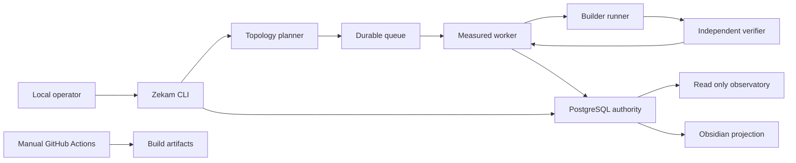

# Zekam Measured Loop Threat Model

## Executive summary

Zekam'in en yuksek riskli alanlari PostgreSQL'deki kanonik Work/loop kayitlarinin
butunlugu, effect'in receipt olmadan yeniden calistirilmasi ve olcum/validator
kanitinin builder tarafindan etkilenmesidir. Mevcut tasarim; loopback PostgreSQL,
varsayilan kapali ag/provider politikasi, realm-bagli RLS, immutable digest zincirleri,
one-job-per-attempt, bagimsiz verifier ve salt okunur allow-list projection ile riski
azaltir. Buna karsin tek yerel operator modeli bir kimlik dogrulama kontrolu degildir;
host veya veritabani kimlik bilgileri ele gecirilirse kalan kontrollerin bir kismi
gecilebilir. LAN observatory acilirsa ayrica kimlik dogrulamasi olmayan metadata ifsasi
riski dogar.

## Scope and assumptions

In-scope:

- Measured-loop domain, orchestration, worker, PostgreSQL adapter ve migration 76:
  `src/zekam/domain/`, `src/zekam/application/`,
  `src/zekam/infrastructure/postgres/`,
  `migrations/0076_measured_loop_execution_plane.sql`.
- Salt okunur CLI/observatory ve Obsidian projection:
  `src/zekam/interfaces/cli/loop.py`,
  `src/zekam/application/loop_observatory.py`,
  `src/zekam/infrastructure/storage/obsidian_projection_store.py`.
- Runtime guvenlik ve gercek PostgreSQL yolculugu kaniti:
  `tests/security/test_measured_loop_wp14_security.py`,
  `tests/e2e/test_measured_loop_wp14.py`.
- Paket/CI ayarlari yalniz runtime'a kaynak veya artifact saglayan sinir olarak
  kapsamdadir: `.github/workflows/` ve `pyproject.toml`.

Out-of-scope: PostgreSQL'in kendi CVE/host hardening'i, ucuncu taraf model provider
altyapisi, isletim sistemi yonetici hesabinin ele gecirilmesi ve test fixture'larinin
uretim verisi olarak kullanilmasi.

Varsayimlar:

- Uretim kullanim sekli yerel Windows CLI ve worker'dir; PostgreSQL loopback'te tek
  kanonik authority'dir.
- Ag ve provider cagirilari varsayilan kapali, secret/PII/raw transcript private
  siniflandirmadadir ve projection'a girmez.
- Tek yerel operator deployment varsayimidir; kod tarafindan enforce edilen bir
  authn/authz mekanizmasi degildir.
- LAN observatory kapali kalir. Acilirsa onune ayrica kimlik dogrulama, TLS ve oran
  siniri konulmadikca metadata ifsasi olasiligi artar.
- Kullanici, bu varsayimlari onceden onaylamis ve baglamsal kararlar bagimsiz
  subagent dogrulamasi ile ele alinmistir.

Risk siralamasini maddi olarak degistirecek acik sorular:

- Gelecekte birden cok isletim sistemi kullanicisi ayni realm veya DB kimligini
  paylasacak mi?
- Observatory LAN'a acilacaksa hangi authn/authz ve TLS sonlandirma katmani
  kullanilacak?
- Provider cagirilari acildiginda egress allow-list ve secret broker hangi process
  boundary'sinde uygulanacak?

## System model

### Primary components

- CLI, yerel operator girdisini parse eder; loop alt komutlari yalniz bounded ve
  authority-free gorunum verir (`src/zekam/interfaces/cli/loop.py`, `LoopObservatory`).
- Topology planner TaskPlan oncesinde direct, single-pass, bounded-loop, tournament,
  graph, queue-human-review veya blocked karari verir
  (`src/zekam/application/topology_planner.py`, `TopologyPlanner`).
- Durable orchestrator her attempt'i ayri `max_attempts=1` job'a baglar ve stale
  progress packet'i reddeder (`src/zekam/application/loop_orchestrator.py`,
  `DurableLoopOrchestrator.plan_attempt`).
- Worker, admission, external measurement, completion ve gerekiyorsa bir sonraki
  job enqueue adimlarini DB transaction sinirinda birlestirir
  (`src/zekam/application/measured_loop_worker.py`, `MeasuredLoopWorkerHandler`).
- PostgreSQL; objective, validator manifest, metric evidence, progress packet,
  control event, attempt/job ve terminal kayitlarinin tek otoritesidir
  (`migrations/0076_measured_loop_execution_plane.sql`).
- Obsidian store kanonik DB'den uretilen immutable generation'i dogrular; CURRENT
  pointer ve receipt drift'i fail-closed reddeder
  (`src/zekam/infrastructure/storage/obsidian_projection_store.py`,
  `LocalObsidianProjectionStore.verify_current`).
- GitHub Actions runtime'dan ayridir ve yalniz manuel `workflow_dispatch` ile
  calisir (`.github/workflows/quality.yml`,
  `.github/workflows/package-acceptance.yml`).

### Data flows and trust boundaries

- Yerel operator -> CLI: argumanlar, UUID/digest ve dosya referanslari process
  argv/env/file kanaliyla gecer. Typer tipleri ve domain modelleri normalize eder;
  loop gorunum komutlari limit 1..100 ve read-only'dir. Host kullanicisi guven
  siniridir; ek bir uygulama login'i yoktur.
- CLI/worker -> PostgreSQL: Work, job, claim, receipt, objective, manifest, metric ve
  packet verisi yerel TCP/DB protokolu ile gecer. Realm session, RLS, foreign key,
  security-definer fonksiyonlari, exact digest baglari ve schema kontrolleri vardir;
  loopback tasima sifrelemesi deployment'a baglidir.
- Builder/runner -> validator/verifier: artifact digest, hypothesis/patch/failure
  fingerprint ve olcum referanslari process/queue ve DB uzerinden gecer. Builder ile
  verifier assignment kimlikleri farkli olmali; builder validator asset write scope'una
  giremez. Model self-report progress sayilmaz.
- Worker -> runtime queue/effect ledger: bir attempt bir job ve bir idempotency digest
  ile gecer. Job `max_attempts=1`; effect varsa claim-before-effect ve terminal receipt
  siniri ayrica korunur. Crash sonrasi receipt yoksa sessiz retry yasaktir.
- PostgreSQL -> observatory/Obsidian: yalniz UUID, digest, sayisal metric, butce ve
  terminal metadata bounded gorunume cikar. Raw JSON body observatory'de wholesale
  dondurulmez; Obsidian immutable generation, manifest ve receipt ile dogrulanir.
- Repository -> GitHub Actions/artifact: gelistirici kontrollu source manuel workflow'a
  gider. Actions salt okunur repository iznine sahiptir; dependency indirme ve artifact
  build ayri supply-chain siniridir.

#### Diagram

## Assets and security objectives

| Asset | Why it matters | Security objective (C/I/A) |
|---|---|---|
| PostgreSQL Work, loop, job, claim ve receipt ledger'i | Yetki, tekrar deneme ve tamamlanma gercegini belirler | I/A |
| Objective, metric vector ve progress decision | Olculmemis ilerlemenin basari sayilmasini engeller | I/A |
| Validator asset manifest ve fixture/threshold digestleri | Builder'in hedefi veya testi kendi lehine degistirmesini engeller | I |
| Secret, PII ve raw transcript | Projection, log veya Git yoluyla ifsa kullaniciya zarar verir | C |
| Source revision ve loop-owned patch zinciri | Stale plan ve genis rollback kullanici degisikliklerini bozabilir | I/A |
| Effect claim ve terminal receipt | Crash/retry sonrasi duplicate dis etkiyi engeller | I/A |
| Observatory ve Obsidian metadata | Is, proje, metric ve operasyon durumu hassas olabilir | C/I |
| Build artifact ve dependency zinciri | Ele gecirilmis paket yerel operator/DB yetkisiyle calisabilir | I |

## Attacker model

### Capabilities

- Yerel dusuk yetkili kullanici veya ayni hosttaki kotucul process; CLI girdisi,
  secilebilir dosya/env ve erisebildigi local portlari deneyebilir.
- Ele gecirilmis builder/model ciktisi; candidate, hypothesis ve patch onerebilir,
  tekrarli veya zararlı payload uretmeye calisabilir.
- DB kimlik bilgisi sizintisi halinde `zekam_app` rolunun izin verdigi fonksiyonlari
  cagirmaya ve cross-realm/IDOR benzeri bag drift'leri denemeye calisabilir.
- LAN observatory sonradan acilirsa erisilebilir metadata endpoint/portlarini tarayabilir.
- Dependency veya manuel CI girdisini zehirlemeye calisan supply-chain saldirgani.

### Non-capabilities

- Varsayilan durumda internetten dogrudan CLI, worker veya PostgreSQL'e erisim yoktur.
- Builder'in veritabani yoneticisi, OS yoneticisi veya validator asset deposunda yazma
  yetkisi oldugu varsayilmaz.
- Provider/model cagrisinin exact authorization olmadan calistigi varsayilmaz.
- Host/DB yoneticisinin tamamen ele gecirilmesi halinde uygulama-seviyesi RLS'nin
  guvenlik siniri olacagi iddia edilmez.

## Entry points and attack surfaces

| Surface | How reached | Trust boundary | Notes | Evidence (repo path / symbol) |
|---|---|---|---|---|
| `zekam loop` CLI | Yerel argv/env | Operator -> process | Read-only, UUID ve limit typed; authority vermez | `src/zekam/interfaces/cli/loop.py` / `app`, `_read` |
| Runtime queue worker | DB job claim | Queue -> worker | Capability-bagli; measured attempt `max_attempts=1` | `src/zekam/application/measured_loop_worker.py` / `build_measured_loop_worker` |
| Loop admission/completion | Security-definer SQL | App role -> canonical DB | Current job, packet, novelty, invocation ve receipt baglarini denetler | `migrations/0076_measured_loop_execution_plane.sql` / `admit_loop_attempt_current`, `complete_loop_attempt_current` |
| Measured JSON persistence | Objective/evidence/packet JSONB | Builder/verifier -> DB | Recursive forbidden key/value ve boyut kontrolu | `migrations/0076_measured_loop_execution_plane.sql` / `assert_measured_payload_safe` |
| Topology selection | TaskPlan ve risk metadata | Operator/planner -> execution | Unknown/high-risk effect fail-closed human review | `src/zekam/application/topology_planner.py` / `TopologyPlanner._recommend` |
| Inverse rollback | Loop-owned patch | Worker -> source tree | Exact baseline, protected dirty state ve allowed path kontrolu | `src/zekam/application/loop_rollback.py` / `LoopRollbackService` |
| Observatory projection | Local CLI, olasi LAN adapter | DB -> reader | Allow-list ve bounded metadata; LAN auth kodu bu scope'ta yok | `src/zekam/application/loop_observatory.py` / `LoopObservatory` |
| Obsidian projection | Yerel dosya sistemi | DB snapshot -> user view | Symlink reddi, immutable generation, digest/receipt verify | `src/zekam/infrastructure/storage/obsidian_projection_store.py` / `LocalObsidianProjectionStore` |
| Manual CI | GitHub UI/API dispatch | Developer/GitHub -> build runner | Otomatik push/PR tetigi yok; dependency indirme var | `.github/workflows/quality.yml`, `.github/workflows/package-acceptance.yml` |

## Top abuse paths

1. Saldirgan builder ciktisina yuksek bir self-reported skor yazar -> bunu external
   evidence gibi sunar -> ilerleme uydurup yeni attempt almaya calisir -> evaluator ve
   DB producer/verifier ayrimi bunu `invalid` yapmazsa butce ve source butunlugu bozulur.
2. Kotucul builder validator threshold veya fixture logical ref'ine yazma yetkisi ister
   -> testi kolaylastirir -> ayni patch'i basarili gosterir -> gecersiz candidate promote
   edilir.
3. Worker effect'i uygular ve receipt yazmadan coker -> ayni logical attempt yeniden
   claim edilir -> effect iki kez calisir -> dis sistem veya Git durumu bozulur.
4. Eski progress packet yeni source/plan/policy ile tekrar oynatilir -> worker stale
   hipotezi uygular -> kullanici degisikliklerinin ustune yanlis patch gelir.
5. Saldirgan farkli metinlerle ayni hypothesis/patch/failure'i tekrarlar -> novelty
   kontrolunu asar -> plateau yerine sonsuz maliyet/queue tuketimi olusur.
6. Yerel metadata servisi LAN'a kimlik dogrulamasiz acilir -> ag kullanicisi work UUID,
   metric, butce ve terminal durumunu toplar -> operasyonel bilgi ifsa olur.
7. Zehirlenmis dependency manuel CI'da calisir -> artifact'e kotucul kod ekler -> yerel
   CLI/worker kurulunca DB veya dosya sistemi yetkilerini kotuye kullanir.

## Threat model table

| Threat ID | Threat source | Prerequisites | Threat action | Impact | Impacted assets | Existing controls (evidence) | Gaps | Recommended mitigations | Detection ideas | Likelihood | Impact severity | Priority |
|---|---|---|---|---|---|---|---|---|---|---|---|---|
| TM-001 | Ele gecirilmis builder/model | Candidate uretebilme | Self-report veya sahte external metric ile progress uydurma | Yanlis promotion ve butce tuketimi | Metric, source, queue | Producer/verifier ayrimi ve self-report reddi (`measured_loop_repository.py` / `store_loop_progress`; `test_measured_loop_wp14_security.py`) | Measurement identity deployment'ta gercek process izolasyonuna bagli | Verifier icin ayri OS/process credential kullan; evidence source attestation'ini policy'ye bagla | `invalid-measurement`, ayni identity ve anormal skor sicrama alarmi | medium; model ciktisi untrusted | high; source kararini etkiler | high |
| TM-002 | Kotucul builder veya app-role | Validator ref'lerine yazma veya manifest drift denemesi | Fixture/metric/threshold'u degistirip sonucu manipule etme | Test oracle butunlugu kaybi | Validator manifest, promotion | Assignment ayrimi, manifest digest ve builder write overlap reddi (`0076_measured_loop_execution_plane.sql` / `store_measured_loop_contract`; security test) | Logical ref'in fiziksel ACL ile ayni oldugu deployment'a bagli | Validator assetleri read-only OS mount/ayri DB role ile koru; source digest'i verifier yeniden hesaplasin | Manifest drift ve denied write scope sayaci | medium | high | high |
| TM-003 | App-role veya replay yapan yerel process | Eski packet/job kimligine erisim | Stale packet, ordinal veya novelty digest replay | Yanlis patch, duplicate attempt | Source, loop ledger | Exact objective/source/plan/policy/manifest baglari, unique ordinal/novelty, deterministic idempotency (`loop_orchestrator.py`; migration 76) | Host admin DB verisini degistirebilir; clock/source binding operasyonel hata yapabilir | Admission oncesi current HEAD ve dependency digest attestasyonu; replay violation alarmi | Idempotency drift, duplicate novelty, stale packet retlerini izle | low-medium | high | high |
| TM-004 | Crash, worker veya adapter arizasi | Effect receipt yazilmadan process kaybi | Receiptless effect'i sessiz tekrar calistirma | Duplicate push/message/migration | Effect ledger, dis sistem | One-job-per-attempt ve E2E claim/receipt/checkpoint (`test_measured_loop_wp14.py` / real PostgreSQL journey) | Runner ile effect ledger arasinda tum adapterler icin atomiklik yoktur | Her effect adapterinde claim-before-effect + provider reconciliation; receipt yoksa `recovery-required`, otomatik retry yok | Receipt'siz terminal claim ve lease expiry alarmi | medium; crash gercekci | high | high |
| TM-005 | Kotucul payload uretecisi | JSONB persistence yoluna erisim | Secret/PII/raw transcript'i nested JSON veya deger deseniyle ledger/projection'a sokma | Kalici hassas veri ifsasi | Secret, PII, transcript | Recursive key/value guard, 256 KiB bound, allow-list observatory ve security tests (`assert_measured_payload_safe`; `LoopObservatory`) | Regex tum secret formatlarini kapsayamaz; serbest metin PII kalabilir | Typed schema allow-list'i storage boundary'de zorunlu kil; secret scanner ve classification deny-by-default ekle | Payload guard retleri ve pre-commit/DB DLP taramasi | medium | high | high |
| TM-006 | LAN saldirgani | Observatory'nin LAN'a auth olmadan acilmasi | Bounded metadata'yi toplama, sorgu ile DoS | Is bilgisi ifsasi ve availability kaybi | Observatory metadata, DB | Varsayilan local/off; read-only allow-list ve limit 100 (`loop_observatory.py`) | LAN authn/TLS/rate-limit bu scope'ta yok | LAN acmadan once mTLS veya OIDC reverse proxy, per-user authz, rate limit ve bind allow-list zorunlu kil | Remote peer, 401/403 ve sorgu hacmi loglari | low varsayilan; high acilirsa | medium | medium (conditional) |
| TM-007 | Kotucul/bozuk yerel caller | Enqueue/admission erisimi | Tekrarli attempt/job ile queue ve token maliyetini tuketme | Worker availability/maliyet kaybi | Queue, budgets | `max_attempts=1`, unique loop/ordinal/idempotency, deadline/token/cost ve plateau/oscillation stop (`loop_orchestrator.py`; `loop_progress.py`) | Realm bazli global quota/rate limit kaniti yok | Realm/project concurrent loop ve cost quota; circuit breaker; queue age alarmi | Ready job yasi, enqueue rejection, budget slope | medium | medium | medium |
| TM-008 | Yerel process/DB credential thief | App DB credential veya realm context erisimi | Cross-realm kayit okuma/yazma veya authorization fonksiyonlarini suistimal | Kanonik authority butunlugu/ifsasi | Tum DB ledger | RLS/FORCE RLS, current realm, FK ve function grantleri (migration 76) | Tek operator auth degildir; credential rotation/transport politikasi repo disi | Ayri least-privilege runtime/observer roller; short-lived credential; loopback firewall; TLS gerekiyorsa pinning | Cross-realm denial, beklenmeyen role/session, auth event alarmi | low-medium | high | high |
| TM-009 | Supply-chain saldirgani | Dependency veya GitHub Action kompromisi | Build artifact'e kod ekleme | Yerel CLI/worker kompromisi | Artifact, DB credentials | Manual-only workflow, contents read, multi-OS smoke, audit/SBOM (`.github/workflows/`) | Action SHA pinleri ve tam dependency hash pinleri yok | Actions'i commit SHA ile pinle; lock/hash ve provenance imzasi ekle; artifact attestasyonu dogrula | SBOM farki, provenance ve dependency audit alertleri | low-medium | high | medium |
| TM-010 | Yanlis/zararli rollback caller | Regression sonucu ve source write erisimi | Genis reset veya kullanici dirty dosyasini geri alma | Veri kaybi ve source butunlugu kaybi | Source tree | Yalniz loop-owned inverse patch, allowed paths, protected dirty digest ve apply-check (`loop_rollback.py`; E2E rollback testi) | Binary/farkli VCS adapterleri ayri dogrulama ister | Her adapter icin dry apply, exact diff receipt ve post-state verifier; blanket reset'i policy'de yasakla | Rollback changed-resource seti ve protected digest drift alarmi | low | high | medium |

En etkili siralama varsayimlari local-only/loopback deployment, tek operator ve provider
default-deny'dir. PostgreSQL veya observatory internete/LAN'a acilir, ortak credential
kullanilir ya da builder/verifier ayni execution boundary'yi paylasirsa TM-001, TM-006
ve TM-008 en az bir seviye yukseltilmelidir.

## Criticality calibration

- **critical:** Local-only varsayimi bozuldugunda pre-auth remote code execution; DB
  authority'yi kalici ve izsiz degistiren admin/auth bypass; secret/PII'nin genis capli
  disariya aktarimi.
- **high:** Receiptless duplicate migration/push; validator/metric manipulasyonuyla
  hatali source promotion; app credential ile cross-realm Work/receipt degisikligi.
- **medium:** Authsiz LAN observatory metadata ifsasi; bounded queue DoS; kullanici dirty
  verisini koruyan kontroller varken hedefli rollback hasari; manuel CI dependency
  kompromisi icin ek onkosul gerektiren supply-chain yolu.
- **low:** Yalniz sanitize digest/UUID ifsasi ve local erisim gerektiren dusuk etkili
  bilgi kacagi; kolay geri alinan tekil read-only CLI kaynak tuketimi; basarisiz ve
  kayitli schema/replay denemesi.

Ornekler mevcut local-only baglama gore kalibre edilmistir. LAN/internet exposure,
multi-tenant kullanim veya ortak DB credential devreye girerse remote metadata, IDOR ve
DoS bulgulari daha yuksek sayilmalidir.

## Focus paths for security review

| Path | Why it matters | Related Threat IDs |
|---|---|---|
| `migrations/0076_measured_loop_execution_plane.sql` | RLS, grants, payload guard, immutable ledger ve current admission/completion kapilari | TM-001, TM-002, TM-003, TM-005, TM-008 |
| `src/zekam/infrastructure/postgres/measured_loop_repository.py` | External evidence, progress decision ve attempt/job binding adapteri | TM-001, TM-003, TM-005, TM-007 |
| `src/zekam/infrastructure/postgres/loop_policy_repository.py` | Admission/completion parametrelerini DB authority fonksiyonlarina baglar | TM-003, TM-004, TM-008 |
| `src/zekam/application/measured_loop_worker.py` | Runner, progress, terminal completion ve next enqueue transaction siniri | TM-001, TM-003, TM-004, TM-007 |
| `src/zekam/application/loop_orchestrator.py` | Deterministik attempt/job, packet freshness ve one-job-per-attempt | TM-003, TM-007 |
| `src/zekam/domain/optimization.py` | Yonlu metric vector, self-report ve validator manifest semantics | TM-001, TM-002 |
| `src/zekam/domain/loop_progress.py` | No-op, plateau, oscillation, regression ve stale packet stop kapilari | TM-003, TM-007 |
| `src/zekam/application/loop_rollback.py` | Kullanici degisikliklerini koruyan exact inverse rollback boundary | TM-010 |
| `src/zekam/application/loop_observatory.py` | Metadata allow-list ve bounded DB projection | TM-005, TM-006 |
| `src/zekam/infrastructure/storage/obsidian_projection_store.py` | Symlink, CURRENT pointer, digest ve receipt provenance kontrolleri | TM-005 |
| `src/zekam/application/topology_planner.py` | High-risk effect'in human review'e yonlendirilmesi | TM-004, TM-007 |
| `.github/workflows/package-acceptance.yml` | Dependency, artifact, SBOM ve database rehearsal supply-chain siniri | TM-009 |

Quality check:

- [x] Bulunan CLI, worker, DB, projection ve CI entry point'leri kapsandi.
- [x] Operator/process, app/DB, builder/verifier, DB/projection ve repo/CI sinirlari
  en az bir threat ile eslendi.
- [x] Runtime davranisi ile CI/build ve tests/examples ayrildi.
- [x] Kullanici tarafindan verilen deployment varsayimlari ve subagent dogrulamasi
  rapora yansitildi.
- [x] Acik sorular ve risk siralamasini degistirecek varsayimlar belirtildi.
